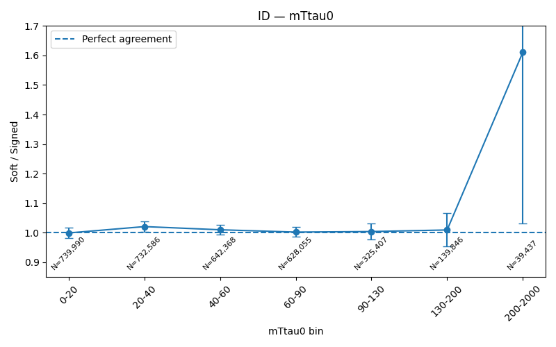
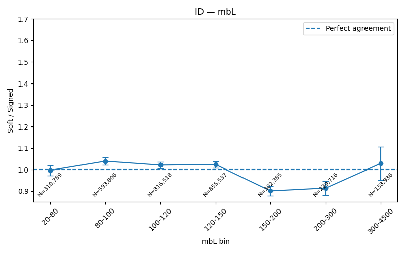
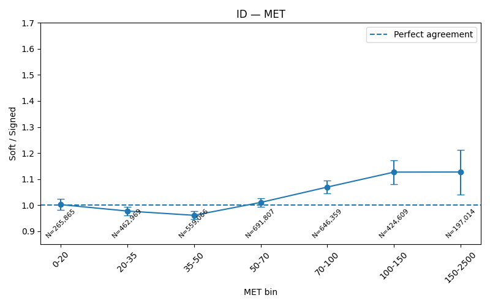
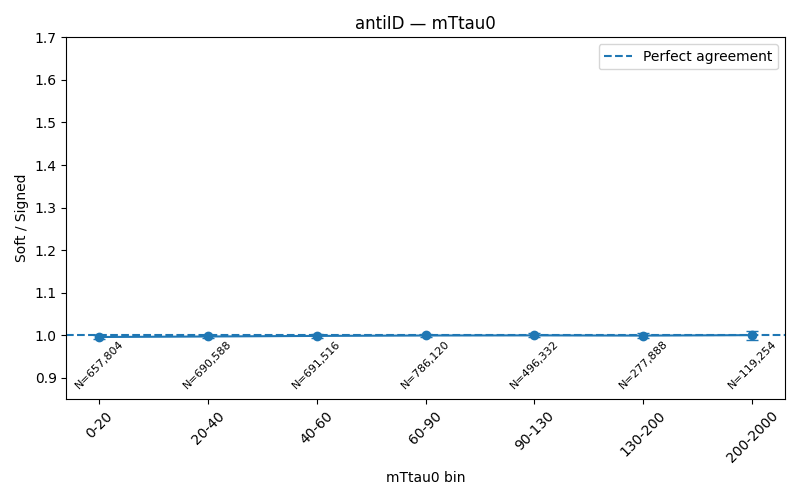
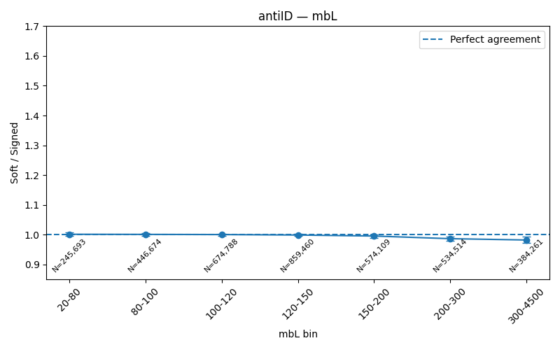
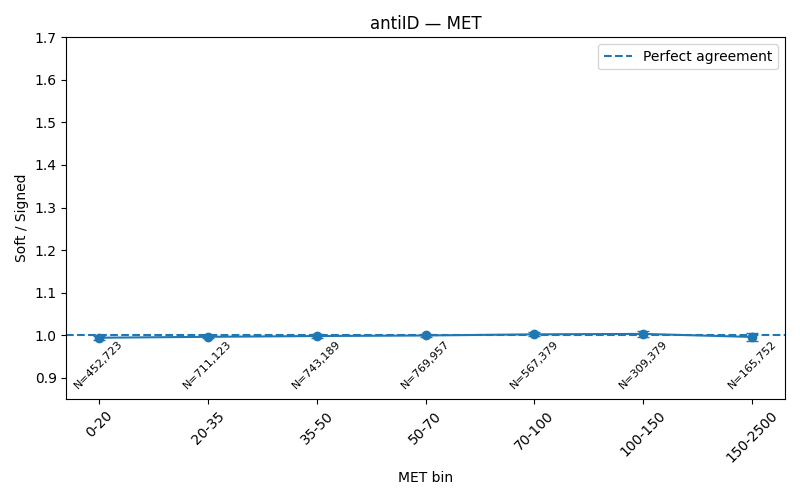
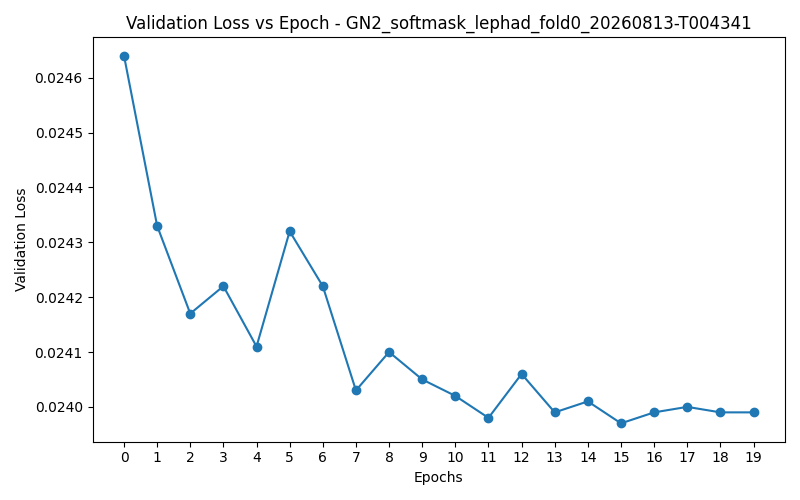
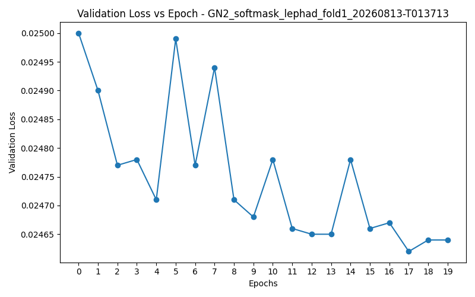
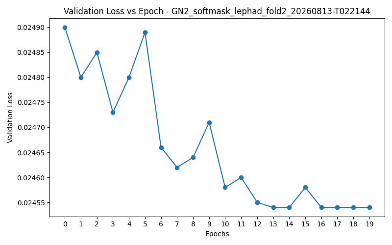

# Softmask Fake-Factor Validation

## S1 - Validate the Fake Factor Inputs
The signed fake-factor weights assign positive weights to data and negative weights to simulation so that summing them subtracts the simulated non-fake contribution, while the fake factor is the ratio of ID to anti-ID fake yields used to map the observed anti-ID fake yield into a prediction of the fake-tau yield in the ID region.
inclusive FF : 0.0753  published 0.0754   deviation -0.07%

## S2 - Softmask GNN Benchmark
The softmask GNN benchmark comparisons for folds 0, 1, and 2 can be seen below:

### Fold 0:
| Variable | Binned RMS | GNN RMS |
|---|---:|---:|
| mbL | 0.139 | 0.032 |
| T1 | 0.130 | 0.029 |
| mTtau0 | 0.091 | 0.037 |
| MET | 0.062 | 0.062 |
| HT | 0.056 | 0.036 |
| mBB | 0.046 | 0.037 |
| dRTauLep | 0.029 | 0.019 |
| mTauTauVis | 0.045 | 0.038 |

**Verdict:** GNN flatter in 8 of 8 unused variables.

### Fold 1:
| Variable | Binned RMS | GNN RMS |
|---|---:|---:|
| mbL | 0.063 | 0.060 |
| T1 | 0.072 | 0.051 |
| mTtau0 | 0.092 | 0.033 |
| MET | 0.043 | 0.035 |
| HT | 0.052 | 0.052 |
| mBB | 0.054 | 0.024 |
| dRTauLep | 0.064 | 0.046 |
| mTauTauVis | 0.074 | 0.087 |

**Verdict:** GNN flatter in 6 of 8 unused variables; binned flatter in 2.

### Fold 2:
| Variable | Binned RMS | GNN RMS |
|---|---:|---:|
| mbL | 0.141 | 0.036 |
| T1 | 0.150 | 0.034 |
| mTtau0 | 0.132 | 0.059 |
| MET | 0.070 | 0.073 |
| HT | 0.048 | 0.030 |
| mBB | 0.061 | 0.047 |
| dRTauLep | 0.064 | 0.050 |
| mTauTauVis | 0.047 | 0.040 |

**Verdict:** GNN flatter in 7 of 8 unused variables; binned flatter in 1.

### Complete Data Tables:
<details>
<summary>Full Fold 0 benchmark output</summary>

#### mbL

| Bin | Actual | Binned | GNN |
|---|---:|---:|---:|
| 20–97 | 4,667 | 1.004 | 1.038 |
| 97–116 | 4,669 | 0.924 | 0.949 |
| 116–136 | 4,137 | 0.955 | 0.980 |
| 136–191 | 2,885 | 1.040 | 1.009 |
| 191–2923 | 940 | 1.296 | 1.022 |
| **RMS deviation** | — | **0.139** | **0.032** |

#### T1

| Bin | Actual | Binned | GNN |
|---|---:|---:|---:|
| -25–-12 | 4,917 | 0.935 | 0.985 |
| -12–-9 | 4,528 | 0.979 | 1.034 |
| -9–9 | 4,136 | 0.961 | 0.949 |
| 9–13 | 2,798 | 1.072 | 1.012 |
| 13–25 | 919 | 1.269 | 1.002 |
| **RMS deviation** | — | **0.130** | **0.029** |

#### mTtau0

| Bin | Actual | Binned | GNN |
|---|---:|---:|---:|
| 0–20 | 3,695 | 0.898 | 1.037 |
| 20–39 | 3,902 | 0.920 | 0.956 |
| 39–60 | 4,007 | 0.987 | 0.953 |
| 60–90 | 3,646 | 1.102 | 1.021 |
| 90–1943 | 2,048 | 1.117 | 1.027 |
| **RMS deviation** | — | **0.091** | **0.037** |

#### MET

| Bin | Actual | Binned | GNN |
|---|---:|---:|---:|
| 0–29 | 4,080 | 0.975 | 0.967 |
| 29–45 | 4,251 | 0.968 | 0.959 |
| 45–63 | 4,008 | 0.971 | 0.978 |
| 63–90 | 3,176 | 1.000 | 1.026 |
| 90–2281 | 1,784 | 1.130 | 1.123 |
| **RMS deviation** | — | **0.062** | **0.062** |

#### HT

| Bin | Actual | Binned | GNN |
|---|---:|---:|---:|
| 128–301 | 4,044 | 1.091 | 1.014 |
| 301–379 | 4,870 | 0.965 | 0.945 |
| 379–477 | 4,026 | 0.958 | 0.994 |
| 477–649 | 2,882 | 0.979 | 1.055 |
| 649–7133 | 1,476 | 0.937 | 0.990 |
| **RMS deviation** | — | **0.056** | **0.036** |

#### mBB

| Bin | Actual | Binned | GNN |
|---|---:|---:|---:|
| 150–175 | 3,998 | 0.996 | 0.965 |
| 175–208 | 3,675 | 1.051 | 1.034 |
| 208–254 | 3,769 | 0.970 | 0.969 |
| 254–338 | 3,300 | 1.008 | 1.043 |
| 338–7354 | 2,556 | 0.917 | 0.959 |
| **RMS deviation** | — | **0.046** | **0.037** |

#### dRTauLep

| Bin | Actual | Binned | GNN |
|---|---:|---:|---:|
| 0–2 | 2,573 | 0.940 | 0.998 |
| 2–2 | 3,762 | 0.988 | 1.015 |
| 2–3 | 3,624 | 1.002 | 1.009 |
| 3–3 | 3,480 | 1.000 | 0.991 |
| 3–6 | 3,859 | 1.018 | 0.963 |
| **RMS deviation** | — | **0.029** | **0.019** |

#### mTauTauVis

| Bin | Actual | Binned | GNN |
|---|---:|---:|---:|
| 30–70 | 4,243 | 0.962 | 0.991 |
| 70–94 | 4,419 | 0.974 | 0.979 |
| 94–125 | 3,766 | 1.033 | 1.026 |
| 125–180 | 3,122 | 0.966 | 0.949 |
| 180–3584 | 1,749 | 1.075 | 1.057 |
| **RMS deviation** | — | **0.045** | **0.038** |

**Verdict:** GNN flatter in 8 of 8 unused variables; binned flatter in 0.

</details>
<details>
<summary>Full Fold 1 benchmark output</summary>

#### mbL

| Bin | Actual | Binned | GNN |
|---|---:|---:|---:|
| 19–97 | 4,776 | 0.959 | 0.967 |
| 97–116 | 4,580 | 0.953 | 0.973 |
| 116–136 | 4,195 | 0.948 | 0.984 |
| 136–192 | 2,818 | 1.056 | 1.039 |
| 192–3526 | 1,078 | 1.101 | 0.880 |
| **RMS deviation** | — | **0.063** | **0.060** |

#### T1

| Bin | Actual | Binned | GNN |
|---|---:|---:|---:|
| -27–-12 | 4,814 | 0.957 | 0.980 |
| -12–-9 | 4,760 | 0.929 | 0.967 |
| -9–9 | 3,890 | 1.023 | 1.026 |
| 9–13 | 2,982 | 0.986 | 0.960 |
| 13–26 | 1,003 | 1.135 | 0.904 |
| **RMS deviation** | — | **0.072** | **0.051** |

#### mTtau0

| Bin | Actual | Binned | GNN |
|---|---:|---:|---:|
| 0–20 | 3,680 | 0.888 | 1.020 |
| 20–40 | 3,863 | 0.919 | 0.968 |
| 40–61 | 4,069 | 0.966 | 0.944 |
| 61–90 | 3,779 | 1.058 | 0.972 |
| 90–1843 | 2,057 | 1.136 | 1.009 |
| **RMS deviation** | — | **0.092** | **0.033** |

#### MET

| Bin | Actual | Binned | GNN |
|---|---:|---:|---:|
| 0–29 | 3,949 | 1.003 | 1.000 |
| 29–45 | 4,267 | 0.963 | 0.950 |
| 45–63 | 3,977 | 0.979 | 0.979 |
| 63–90 | 3,360 | 0.931 | 0.958 |
| 90–1566 | 1,895 | 1.051 | 1.036 |
| **RMS deviation** | — | **0.043** | **0.035** |

#### HT

| Bin | Actual | Binned | GNN |
|---|---:|---:|---:|
| 130–301 | 4,273 | 1.036 | 0.932 |
| 301–379 | 4,653 | 1.011 | 0.972 |
| 379–477 | 4,155 | 0.919 | 0.956 |
| 477–649 | 2,948 | 0.944 | 1.051 |
| 649–9411 | 1,419 | 0.953 | 1.060 |
| **RMS deviation** | — | **0.052** | **0.052** |

#### mBB

| Bin | Actual | Binned | GNN |
|---|---:|---:|---:|
| 150–175 | 3,821 | 1.030 | 0.972 |
| 175–208 | 3,871 | 0.998 | 0.969 |
| 208–254 | 3,661 | 1.000 | 1.001 |
| 254–338 | 3,511 | 0.937 | 0.972 |
| 338–6655 | 2,585 | 0.903 | 0.982 |
| **RMS deviation** | — | **0.054** | **0.024** |

#### dRTauLep

| Bin | Actual | Binned | GNN |
|---|---:|---:|---:|
| 0–2 | 2,784 | 0.870 | 0.908 |
| 2–2 | 3,907 | 0.954 | 0.964 |
| 2–3 | 3,570 | 1.010 | 1.002 |
| 3–3 | 3,327 | 1.040 | 1.027 |
| 3–6 | 3,861 | 1.003 | 0.983 |
| **RMS deviation** | — | **0.064** | **0.046** |

#### mTauTauVis

| Bin | Actual | Binned | GNN |
|---|---:|---:|---:|
| 30–70 | 4,445 | 0.899 | 0.913 |
| 70–94 | 4,467 | 0.963 | 0.949 |
| 94–126 | 3,969 | 0.973 | 0.957 |
| 126–181 | 2,862 | 1.063 | 1.057 |
| 181–3637 | 1,705 | 1.105 | 1.151 |
| **RMS deviation** | — | **0.074** | **0.087** |

**Verdict:** GNN flatter in 6 of 8 unused variables; binned flatter in 2.

</details>
<details>
<summary>Full Fold 2 benchmark output</summary>

#### mbL

| Bin | Actual | Binned | GNN |
|---|---:|---:|---:|
| 18–97 | 4,529 | 1.049 | 1.055 |
| 97–116 | 4,426 | 1.004 | 1.036 |
| 116–136 | 4,306 | 0.946 | 0.983 |
| 136–192 | 2,876 | 1.069 | 1.038 |
| 192–4234 | 956 | 1.300 | 1.019 |
| **RMS deviation** | — | **0.141** | **0.036** |

#### T1

| Bin | Actual | Binned | GNN |
|---|---:|---:|---:|
| -25–-12 | 4,701 | 1.000 | 1.044 |
| -12–-9 | 4,507 | 1.006 | 1.046 |
| -9–9 | 4,098 | 0.997 | 0.993 |
| 9–13 | 2,891 | 1.064 | 1.015 |
| 13–27 | 897 | 1.329 | 1.038 |
| **RMS deviation** | — | **0.150** | **0.034** |

#### mTtau0

| Bin | Actual | Binned | GNN |
|---|---:|---:|---:|
| 0–20 | 3,840 | 0.873 | 0.982 |
| 20–40 | 3,696 | 0.994 | 1.030 |
| 40–60 | 3,941 | 1.026 | 1.004 |
| 60–90 | 3,661 | 1.120 | 1.049 |
| 90–1762 | 1,956 | 1.237 | 1.116 |
| **RMS deviation** | — | **0.132** | **0.059** |

#### MET

| Bin | Actual | Binned | GNN |
|---|---:|---:|---:|
| 0–29 | 4,041 | 1.014 | 0.977 |
| 29–45 | 4,201 | 0.992 | 0.987 |
| 45–63 | 3,958 | 1.010 | 1.019 |
| 63–90 | 3,082 | 1.055 | 1.100 |
| 90–1388 | 1,812 | 1.145 | 1.125 |
| **RMS deviation** | — | **0.070** | **0.073** |

#### HT

| Bin | Actual | Binned | GNN |
|---|---:|---:|---:|
| 129–301 | 4,126 | 1.096 | 1.019 |
| 301–379 | 4,689 | 1.027 | 1.015 |
| 379–477 | 3,911 | 1.011 | 1.055 |
| 477–649 | 2,969 | 0.969 | 1.031 |
| 649–6484 | 1,398 | 1.016 | 1.003 |
| **RMS deviation** | — | **0.048** | **0.030** |

#### mBB

| Bin | Actual | Binned | GNN |
|---|---:|---:|---:|
| 150–175 | 3,868 | 1.054 | 1.013 |
| 175–208 | 3,708 | 1.064 | 1.043 |
| 208–254 | 3,480 | 1.082 | 1.089 |
| 254–338 | 3,486 | 0.979 | 1.008 |
| 338–6424 | 2,551 | 0.934 | 0.967 |
| **RMS deviation** | — | **0.061** | **0.047** |

#### dRTauLep

| Bin | Actual | Binned | GNN |
|---|---:|---:|---:|
| 0–2 | 2,630 | 0.944 | 0.979 |
| 2–2 | 3,921 | 0.965 | 0.979 |
| 2–3 | 3,467 | 1.070 | 1.077 |
| 3–3 | 3,300 | 1.077 | 1.074 |
| 3–6 | 3,775 | 1.074 | 1.023 |
| **RMS deviation** | — | **0.064** | **0.050** |

#### mTauTauVis

| Bin | Actual | Binned | GNN |
|---|---:|---:|---:|
| 30–70 | 4,204 | 0.974 | 0.993 |
| 70–94 | 4,318 | 1.027 | 1.027 |
| 94–126 | 3,740 | 1.061 | 1.054 |
| 126–181 | 2,933 | 1.075 | 1.065 |
| 181–2810 | 1,898 | 1.019 | 0.991 |
| **RMS deviation** | — | **0.047** | **0.040** |

**Verdict:** GNN flatter in 7 of 8 unused variables; binned flatter in 1.

</details>
 

## S3 - Softmask Closure Check
This step compares the Softmask subtraction to the Signed Data-MC subtraction in bins of mTtau0, mbL, and MET. We need to answer the question:
"Does the new postive-weight softmask reproduce the fake distribution that the original signed subtraction gave us?"
For this, a ratio of soft-to-signed means perfect closure, or perfect recreation. Ideally, the ration should be consistent with 1.0 within statistical uncertainty

<details>
 <summary>Full check_softmask_closure.py script</summary>
 
 ```python
 """Script for comparing Softmask subtraction to Signed data-MC subtraction
   in bins of mTtau0, mbL, and MET. This is done separately for ID and antiID.
   This also prints a numerical table of the data. For my own Reference:

   -mTtau0 -> Transverse mass of leading Tau candidate
   -mbL -> invariant mass of a bjet and lepton system
   -MET -> Missing Energy Transverse (How much of the picture we see)

   We want the ratio to be close to one to verify that the softmask
   will reproduce the same estimated fake yield that the signed subtraction
   produces."""


import h5py
import numpy as np
import glob
import matplotlib.pyplot as plt
import os

#set preprocessed path variable
PP = "/home/shahzad/ML_Fakes_LepHad/inputData/preprocessed"
OUTDIR = "plots/softmask_closure"
os.makedirs(OUTDIR, exist_ok=True)

#Bin edges for plotting
BINS = {
    "mTtau0": [0, 20, 40, 60, 90, 130, 200, 2000],
    "mbL":    [20, 80, 100, 120, 150, 200, 300, 4500],
    "MET":    [0, 20, 35, 50, 70, 100, 150, 2500],
}

#combine the 3 folds into one big numpy array
ev = np.concatenate([
    h5py.File(f, "r")["events"][:]
        for f in sorted(glob.glob(f"{PP}/fold_*/fakeCR.h5"))
    ])

for region, rsel in (
    ("ID", ev["is_idfake"] == 1),
    ("antiID", ev["is_idfake"] == 0),
): #Iterate separately through each region. rsel -> region selection
    for var in ("mTtau0", "mbL", "MET"):
        x = ev[var][rsel] #Grab events in the selection
        isd = ev["is_data"][rsel] == 1 #Grab real data
        cw = ev["combinedWeight"][rsel] #Grab combined event weights
        sm = ev["softmask_weight"][rsel] #Grab softmask weights
        #Test done to get info to make bin edges
        """x = ev[var]
        print(
            f"{var:8s} "
            f"min={np.nanmin(x):8.2f}  "
            f"p10={np.nanpercentile(x,10):8.2f}  "
            f"p25={np.nanpercentile(x,25):8.2f}  "
            f"median={np.nanmedian(x):8.2f}  "
            f"p75={np.nanpercentile(x,75):8.2f}  "
            f"p90={np.nanpercentile(x,90):8.2f}  "
            f"max={np.nanmax(x):8.2f}"
        )"""
        #Grab the bins of the repective variable to plot against
        edges = BINS[var]

        #Create some arrays for data saving and plotting
        ratios = [] #array of ratios (soft/signed)
        ratio_errs = [] #array of ratio errors
        signed_yields = [] #array of signed subtraction yields
        soft_yields = [] #array of soft subtraction yields
        bin_centers = [] #array of the bin centers
        counts = [] #array of the event counts within bin selections
        #Go through each bin
        for i in range(len(edges) - 1): #8 edges means 7 bins, 7 iterations
            #Define bin edges
            lo = edges[i]
            hi = edges[i+1]
            #Select data that falls in the current bin
            bsel = (x >= lo) & (x < hi)
            #boolean mask of data
            data_mask = bsel & isd
            #boolean mask of MC
            mc_mask = bsel & ~isd

            #Compute the Signed Subtraction: Nfake = Ndata - NMC
            #first part finds all events in curent bin that is real data and sums their weights
            #second part finds all events in current bin that is NOT real data and sums weights
            # ~ is a NOT operator for boolean masks
            signed = cw[data_mask].sum() - cw[mc_mask].sum()

            #Compute the softmask subtraction. Grab events and sum softmask weights
            soft = sm[bsel].sum()

            #Compute the signed subtraction error from weighted sums
            signed_err = np.sqrt(np.sum(cw[data_mask] ** 2)
                    + np.sum(cw[mc_mask] ** 2)
                    )

            #Compute the softmask error from its weighted sums
            soft_err = np.sqrt(np.sum(sm[bsel] ** 2))

            #Compute their ratio
            if soft != 0 and signed != 0:
                ratio = soft/signed
                ratio_err = abs(ratio) * np.sqrt(
                        (soft_err/soft) ** 2
                        + (signed_err/signed) ** 2
                )
            else:
                ratio = np.nan
                ratio_err = np.nan

            #Save data to arrays:
            signed_yields.append(signed)
            soft_yields.append(soft)
            ratios.append(ratio)
            ratio_errs.append(ratio_err)
            counts.append(np.count_nonzero(bsel))
            bin_centers.append((lo + hi) / 2)


        #Now that we have all necessary values, we can print the output table:
        print(f"\n{region} — {var}") #Print the Region
        #Table Header
        print(
                        f"{'bin':>15} "
                        f"{'N events':>12} "
                        f"{'signed':>12} "
                        f"{'soft':>12} "
                        f"{'soft/signed':>14} "
                        f"{'stat err':>12}"
                )

        #Iterate through Bin edges for the current variable and print the data
        for i in range(len(ratios)):
            lo = edges[i]
            hi = edges[i + 1]

            print(
                                f"{lo:6.0f}-{hi:<6.0f} "
                                f"{counts[i]:12,d} "
                                f"{signed_yields[i]:12.1f} "
                                f"{soft_yields[i]:12.1f} "
                                f"{ratios[i]:14.3f} "
                                f"{ratio_errs[i]:12.3f}"
                        )

        #Now for the plotting:
        #Create Figure
        plt.figure(figsize=(8, 5))
        #plot Data

        positions = np.arange(len(ratios))
        labels = [
            f"{edges[i]:.0f}-{edges[i+1]:.0f}"
            for i in range(len(edges) - 1)
        ]

        plt.errorbar(
            positions,
            ratios,
            yerr=ratio_errs,
            marker="o",
            linestyle="-",
            capsize=4
        )

        plt.xticks(positions, labels, rotation=45)
        plt.ylim(0.85, 1.70)
        #Plot value of 1 for comparision
        plt.axhline(
            1.0,
            linestyle="--",
            label="Perfect agreement",
        )

        #add raw event counts:
        for pos, count in zip(positions, counts):
            plt.text(
                pos,
                0.87,
                f"N={count:,}",
                ha="center",
                va="bottom",
                fontsize=8,
                rotation=45,
            )
        '''for pos, ratio, count in zip(positions, ratios, counts):
            plt.annotate(
                    f"N={count:,}",
                    xy=(pos, ratio),
                    xytext=(0, 12),
                    textcoords="offset points",
                    ha="center",
                    fontsize=8
            )'''
        #Labels and Titles
        plt.xlabel(f"{var} bin")
        plt.ylabel("Soft / Signed")
        plt.title(f"{region} — {var}")
        plt.legend()
        plt.tight_layout()
        #Save and Close
        plt.savefig(os.path.join(OUTDIR, f"softmask_{region}_{var}.png"))
        plt.close()
 ```
 
</details>

### ID Region



**Verdict:** The first six bins are excellent: 0.999, 1.021, 1.010, 1.002, 1.004, 1.009. They're all within about 2% of unity. The last bin jumps to 1.610, but this is the extreme tail and has very low statistics compared with the other bins. The error bars showed that this point has a correspondingly large statistical uncertainty. So I would classify this as good closure overall, with a statistically limited final-bin excursion rather than convincing evidence of a shape problem.



**Verdict:** The first four bins are also quite good: 0.997, 1.039, 1.021, 1.024. Then we get 0.901 and 0.914 in the 150–200 and 200–300 bins, followed by 1.029 in the tail. These middle/high-mbL deviations are more interesting than the single mTtau0 tail spike because there are two neighboring bins showing the same downward behavior. So the verdict is generally good closure, but with evidence of a modest shape discrepancy around 150–300 GeV. We shouldn't dismiss those automatically as statistics.



**Verdict:** This is the clearest shape trend. The ratios progress as 1.002, 0.977, 0.961, 1.010, 1.069, 1.127, 1.127. The important feature isn't simply that the final bins are 12.7% high; it's that the ratio systematically rises as MET increases after the middle of the distribution. Multiple neighboring bins move in the same direction. So I'd call this reasonable overall closure but a visible high-MET shape dependence that is unlikely to be explained solely by one low-statistics tail bin.

### anti-ID Region



**Verdict:** 0.996–1.000 across every bin. That's essentially perfect closure.



**Verdict:** Mostly 0.999–1.001 through the bulk, then 0.995, 0.987, 0.982 toward higher mbL. There is a slight downward trend in the tail, but even the largest deviation is only about 1.8%. So this is very good closure, with only a small high-mbL residual.



**Verdict:** 0.994, 0.996, 0.998, 0.999, 1.002, 1.003, 0.996. Again, excellent. Every bin is within roughly 0.6% of unity, with no meaningful shape trend apparent.

## S4 - Validation-Loss Stability
For Step 4 we want to inspect the validation loss as training progresses through the epochs. We are asking the question:
"Does the model learn and settle onto a stable validation-loss plateau, or does validation behavior show signs of instability/divergence?"
This matters because a good final benchmark isn't very reassuring if the underlying training itself is unstable.

<details>
<summary>plot_val_loss.py</summary>
 
```python
"""Script to plot validation loss per epoch"""
import sys
import os
import re
import matplotlib.pyplot as plt

#Check run directory was provided to grab data from
if len(sys.argv) != 2:
    print(f"Usage: python {sys.argv[0]} <run_dir>")
    sys.exit(1)
#Set some needed variables
run_dir = sys.argv[1]
ckpt_dir = os.path.join(run_dir, "ckpts")
run_name = os.path.basename(os.path.normpath(run_dir))


#Make output directory
OUTDIR = "plots/validation_loss"
os.makedirs(OUTDIR, exist_ok=True)

#Used when saving graph
out_path = os.path.join(
    OUTDIR,
    f"{run_name}_val_loss.png"
)

#regualar expression converted to string to search directories
#Regex will grab all epoch files, not just lowest loss
pattern = re.compile( r"epoch=(\d+)-val_loss=([0-9.]+)\.ckpt$")

#arrays to capture parsing
epochs = []
losses = []

#loop for capture
for name in os.listdir(ckpt_dir):
    #re.match checks for matching expression from start of string
    #This returns a boolean
    match = pattern.match(name)

    if match:
        #Capture values if present
        epoch = int(match.group(1))
        loss = float(match.group(2))

        #append to arrays
        epochs.append(epoch)
        losses.append(loss)

#Combine epochs and losses into 1 iterable
#Then sort by epoch
pairs = sorted(zip(epochs, losses))

#separate them again so they're ready for plotting
#This is done because we don't assume the order the files are in within the directory
epochs, losses = zip(*pairs)
#grab the index that contains the lowest loss epoch
best_i = losses.index(min(losses))

#grab the values of the lowest loss epoch
best_epoch = epochs[best_i]
best_loss = losses[best_i]
all_positive = all(loss > 0 for loss in losses)

#Print report to the screen
print(f"\nRun: {run_name}")
print(f"Epochs found: {len(epochs)}")
print(f"Best epoch: {best_epoch}")
print(f"Minimum val_loss: {best_loss:.5f}")
print(f"All losses positive: {all_positive}")
if all_positive:
    print("Training status: HEALTHY")
else:
    print("Training status: NOT HEALTHY")

#plot values
plt.figure(figsize=(8, 5))
plt.plot(epochs, losses, marker='o')
plt.xticks(epochs)
plt.xlabel('Epochs')
plt.ylabel('Validation Loss')
plt.title(f"Validation Loss vs Epoch - {run_name}")
plt.tight_layout()
plt.savefig(out_path)

```
</details>

### Fold 0



**Verdict:** 

### Fold 1



**Verdict:** ...

### Fold 2



**Verdict:** ...

## S5 - Random-Seed Stability
